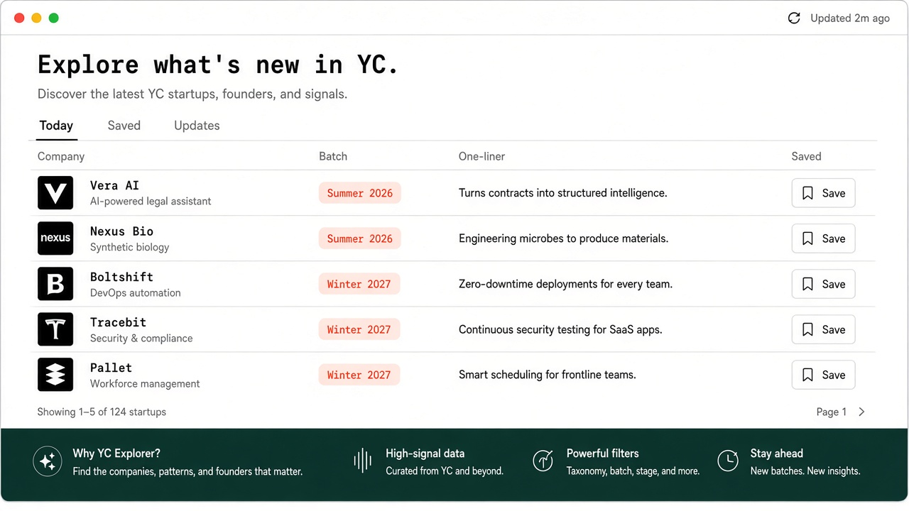
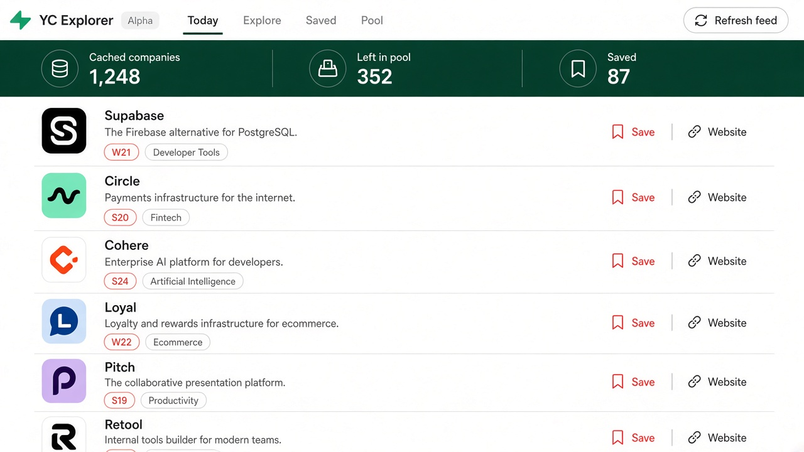
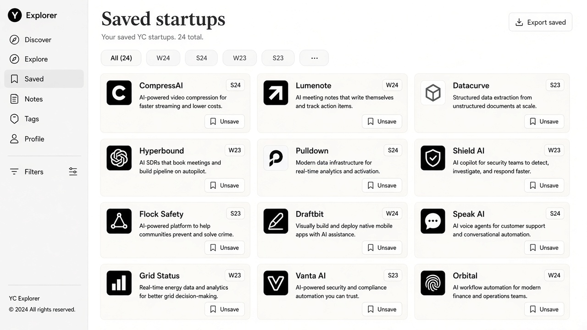

<p align="center">
  
</p>

<h1 align="center">YC Companies Explorer</h1>

<p align="center">
  <strong>A local-first desktop feed for exploring Y Combinator startups.</strong><br/>
  Open the app → get today’s deck → save the interesting ones → keep going.
</p>

<p align="center">
  <a href="https://github.com/Ibrahimrahhal/yc-companies-explorer/releases/latest"></a>
  <a href="LICENSE"></a>
  <a href="https://github.com/Ibrahimrahhal/yc-companies-explorer/stargazers"></a>
  
</p>

<p align="center">
  <a href="#install"><strong>Install</strong></a> ·
  <a href="#features"><strong>Features</strong></a> ·
  <a href="#why-this-exists"><strong>Why</strong></a> ·
  <a href="#develop"><strong>Develop</strong></a> ·
  <a href="#releases"><strong>Releases</strong></a>
</p>

---

## Screenshots

<p align="center">
  
</p>

| Today’s feed | Saved shortlist |
| :---: | :---: |
|  |  |

## Why this exists

YC’s company directory is huge. Opening the website and scrolling forever is a terrible way to casually explore new batches in your free time.

**YC Companies Explorer** turns that into a calm desktop habit:

- a **Startups of the day** deck every time you open it
- ranking that **favors newer batches**
- **Load more** when you finish the set
- **Save** companies you want to revisit
- everything cached **locally** — no account, no cloud lock-in

## Features

- **Daily seeded feed** — deterministic deck for the day, fresh shuffle when you refresh
- **Seen tracking** — companies you’ve viewed are remembered and deprioritized
- **Newest-batch bias** — Summer/Winter/Spring/Fall scoring keeps recent cohorts first
- **Saved shortlist** — pin startups into a local list
- **Directory pulse** — latest added/updated companies from the YC OSS mirror
- **Browser-style zoom** — `Ctrl`/`⌘` + `+` / `-` / `0`, plus Ctrl+scroll
- **Offline-friendly cache** — JSON state under your app data folder

## Install

### Download (recommended)

Grab the latest build from **[Releases](https://github.com/Ibrahimrahhal/yc-companies-explorer/releases/latest)**:

| Platform | Artifact |
| --- | --- |
| Windows | `YC Explorer-*-setup.exe` |
| macOS | `.dmg` / `.zip` |
| Linux | `.AppImage` / `.deb` |

> Windows SmartScreen / Gatekeeper may warn on unsigned builds. That’s expected for a community Electron app — open via “More info” / right-click → Open.

### Run from source

```bash
git clone https://github.com/Ibrahimrahhal/yc-companies-explorer.git
cd yc-companies-explorer
npm install
npm run dev
```

## Data source

Public YC company data via the community mirror **[yc-oss/api](https://github.com/yc-oss/api)**:

- [`companies/all.json`](https://yc-oss.github.io/api/companies/all.json)
- [`changes/latest.json`](https://yc-oss.github.io/api/changes/latest.json)

The app auto-syncs on launch when the cache is empty or older than 6 hours. Manual **Refresh feed** rebuilds today’s deck from companies you haven’t seen yet.

> Not affiliated with Y Combinator. Company data comes from publicly available directory information.

## Local data

Everything lives on disk under Electron `userData` → `yc-explorer-data/state.json`:

- company cache
- saved IDs
- seen IDs
- daily deck + cursor
- zoom preference

Open the folder from the **Updates** tab anytime.

## Develop

```bash
npm install
npm run dev          # Electron + Vite
npm run typecheck    # TS
npm run build        # compile
npm run dist         # Windows installer → release/
```

Stack: **Electron · React · TypeScript · electron-vite · electron-builder**

## Releases

Push a version tag and GitHub Actions builds binaries for Windows, macOS, and Linux, then attaches them to the GitHub Release:

```bash
git tag v0.1.0
git push origin v0.1.0
```

Workflow: [`.github/workflows/release.yml`](.github/workflows/release.yml)

## Roadmap

- [ ] Search + filter across the full local cache
- [ ] Batch picker (jump to S26 / W27 / …)
- [ ] Export saved list to Markdown / CSV
- [ ] Optional dark product band theme toggle
- [ ] Signed / notarized builds

PRs welcome — see [CONTRIBUTING.md](CONTRIBUTING.md).

## License

[MIT](LICENSE) © Ibrahim Rahhal

---

<p align="center">
  If this saves you a rabbit hole of YC tabs, <a href="https://github.com/Ibrahimrahhal/yc-companies-explorer">star the repo</a> ⭐
</p>
